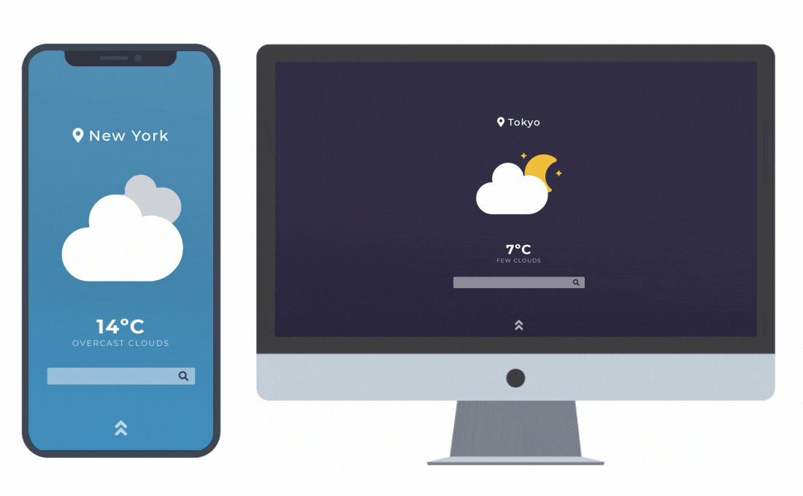

<h1 align="center">
  
</h1>
<h4 align="center">👨🏻‍🚀 Know what's happening up above</h4>

### 📺 Preview

### 💡 Functionalities

- Location is identified automatically (must allow browser to access location)
- User can see the local temperature
- By clicking on the temperature, the user can switch between celcius and fahrenheit
- A small description of the current weather is shown below the temperature
- User can scroll down to see details about the weather
- User can input a city

### 🛠️ Implementations

- [x] Update interface
- [x] Location shown is identified and updated dynamically
- [x] Allow user to input any city
- [ ] ~Auto complete and suggestions for city inputs~ [Google](https://developers.google.com/places/web-service/autocomplete) wants my credit card 💳
- [x] Icons according to the current weather
- [x] Dark theme during night
- [x] Detais section (relative humidity, wind speed, feels like)
- [ ] Show forecast for the next 7 days
- [x] Show min and max temperature

### ⌨️ Code

- [JavaScript](https://www.javascript.com/)
- [Sass (CSS3)](https://sass-lang.com/)
- [HTML5](https://html5.org/)

### 📡 APIs

- ~[7Timer!](http://www.7timer.info/)~
- [Open Weather](https://openweathermap.org/api)

## 📬 [Contact me](https://www.linkedin.com/in/guerrero-roberto/)
